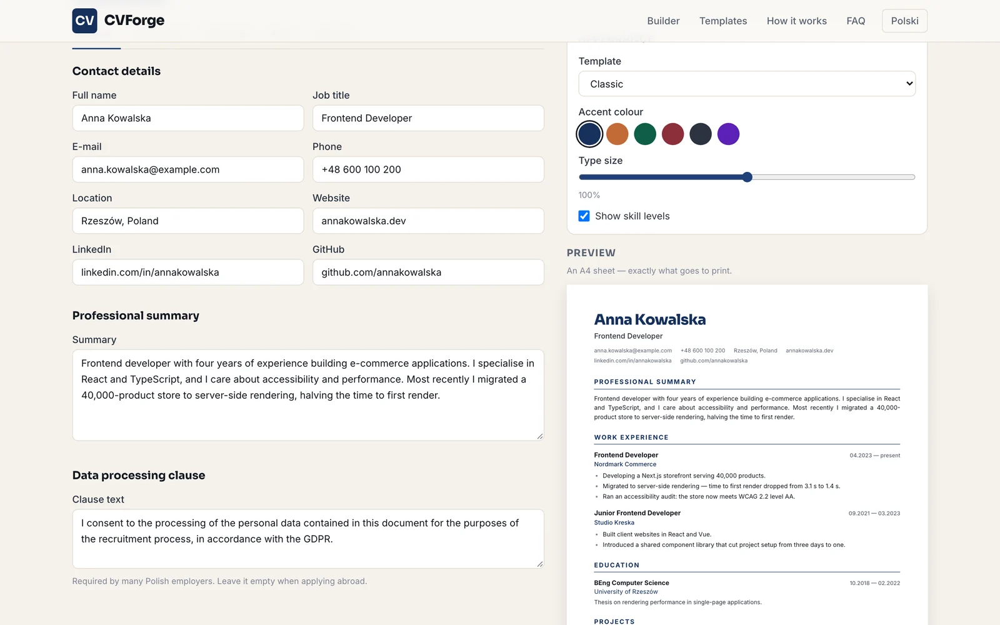
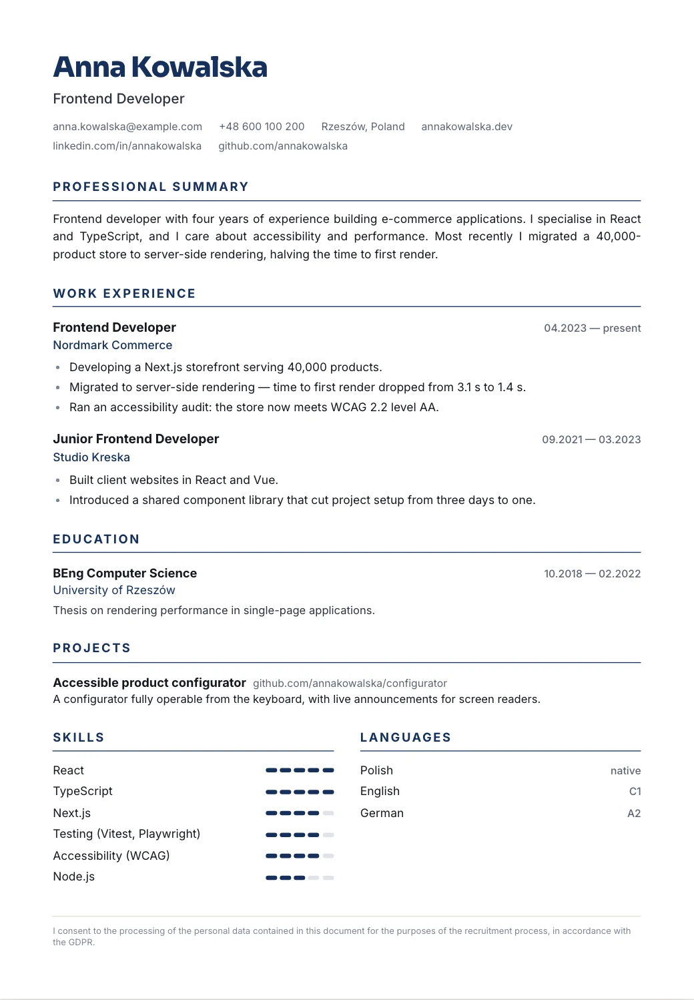
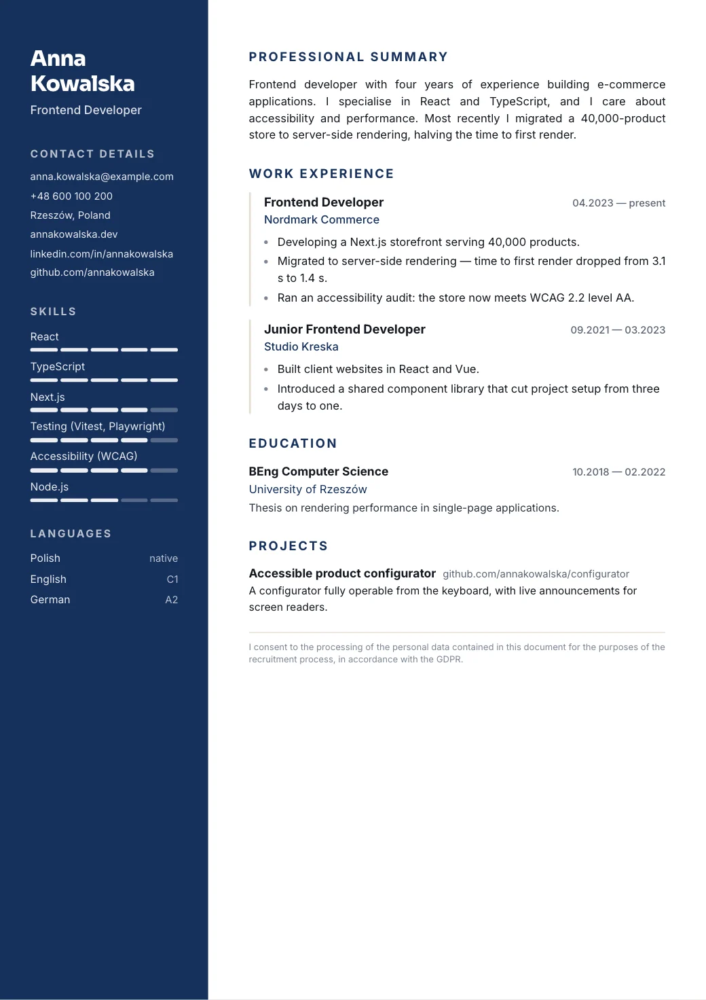
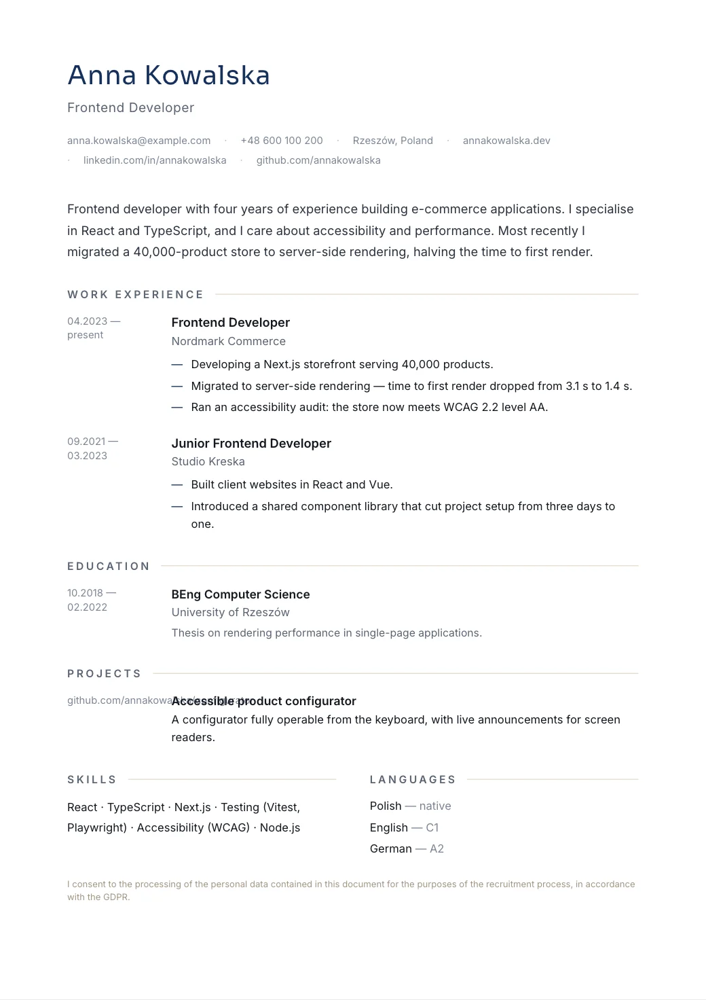

# CVForge

> 📄 **The preview is the print** — a CV builder that renders the same A4 sheet on screen and on paper

**CVForge** turns a form into a finished CV. Fill in your details, choose one of three templates, and print an A4 sheet that looks exactly like the preview. Three layouts share one data model, so switching between them never loses a word you typed.

There is no backend, no account and no upload. The site is prerendered to files and served by GitHub Pages; your CV lives in your own browser and leaves it only when you export it yourself.

[](https://github.com/dawidolko/CVForge-Platform/actions/workflows/deploy.yml)


**Live:** [cvforge.dawidolko.pl](https://cvforge.dawidolko.pl) · **Polski:** [cvforge.dawidolko.pl/pl](https://cvforge.dawidolko.pl/pl/)

---

## 🎯 Key Features

- **The preview is the printed sheet** — not a separate mock-up. The same element is scaled on screen and sent to the printer, so nothing shifts when you press Print.
- **Three templates, one set of content** — Classic, Two-column and Minimal read the same data. Changing the layout never drops a field.
- **Your data never leaves the device** — the site is static and has no server to receive it. Work is saved to `localStorage`, and JSON export moves a CV between computers without an account.
- **Type-size control for the last three lines** — a ±10% slider, for when a CV is almost, but not quite, one page.
- **Bilingual** — English at `/`, Polish at `/pl/`, with matching `hreflang` pairs and separate JSON-LD.
- **A form that a screen reader can use** — every field has a real `<label>` bound by `id`, list rows can be reordered from the keyboard, and status messages are announced through `aria-live`.

---

## 🖼️ Screenshots

| The premise in one screen                                          | The builder: form, appearance and live A4 preview                       |
| ------------------------------------------------------------------ | ------------------------------------------------------------------------ |
|  |  |

| Classic                                                        | Two-column                                                       | Minimal                                                       |
| -------------------------------------------------------------- | ----------------------------------------------------------------- | -------------------------------------------------------------- |
|  |  |  |

---

## 📐 Why the Preview Matches the Print

Most builders draw a preview and generate the PDF somewhere else, which is why the output rarely matches the screen. CVForge renders **one** element, `.arkusz`, fixed at `210mm × 297mm`:

- **On screen** it is scaled with `transform: scale()` and a `ResizeObserver`, while its own width stays 210mm. Scaling never changes how the text wraps.
- **On paper** `@page { size: A4; margin: 0 }` applies, the interface is hidden with `visibility`, and the transform is reset — the browser prints the sheet at its true size.

Because the sheet carries its own margins, the print dialog should be set to **no margins**. Everything else is already in the design.

---

## 🧩 Application Layer

| Layer                            | Responsibility                                                                                          |
| -------------------------------- | --------------------------------------------------------------------------------------------------------- |
| `src/app`                        | Routing, per-language metadata, fonts, JSON-LD. Two prerendered routes: `/` and `/pl/`.                    |
| `src/components/KreatorCV.tsx`   | The single owner of CV state — tabs, appearance, autosave, print, import and export.                       |
| `src/components/FormularzCV.tsx` | The form. Stateless: it receives data and an updater, so it cannot disagree with the preview.               |
| `src/components/PodgladCV.tsx`   | The A4 sheet and its scaling. Picks a template; never touches the data.                                     |
| `src/components/szablony/`       | The three layouts. Each renders the same model and hides empty sections instead of printing bare headings.  |
| `src/components/daneCV.ts`       | Types, the demo CV and date formatting.                                                                     |
| `src/components/magazyn.ts`      | `localStorage` behind a guard, plus JSON import and export with shape validation.                           |
| `src/components/tresc.ts`        | Every string in both languages. Layout lives in components, words live here.                                |
| `src/app/globals.css`            | Design tokens, the A4 sheet and the print rules. No component hard-codes a hex value except the live accent. |

---

## 🛠️ Technology Stack

### Frontend

| Technology       | Version | Role                                                                     |
| ---------------- | ------- | ------------------------------------------------------------------------ |
| **Next.js**      | 16      | App Router with `output: 'export'` — the whole site is prerendered to files. |
| **React**        | 19      | Component model; state lives in one place and flows downwards.             |
| **TypeScript**   | 5       | Strict mode. The CV model is a type, so a template cannot read a missing field. |
| **Tailwind CSS** | 4       | CSS-first configuration; design tokens declared in `@theme`.              |

### Infrastructure

| Element            | Role                                                                   |
| ------------------ | ---------------------------------------------------------------------- |
| **GitHub Actions** | Typecheck, build and an export assertion before anything is published.  |
| **GitHub Pages**   | Static hosting on a custom domain, published to `gh-pages` and as a Pages artifact. |
| **localStorage**   | The only storage the application has — there is no database.            |

---

## 🚀 Getting Started

### Prerequisites

- Node.js 20 or newer
- npm

### 1. Clone the repository

```bash
git clone https://github.com/dawidolko/CVForge-Platform.git
cd CVForge-Platform
```

### 2. Install dependencies

```bash
npm install
```

### 3. Run

```bash
npm run dev        # development server at http://localhost:3000
npm run build      # static export into out/
npm run serve      # serve the built export locally
npm run typecheck  # TypeScript, no emit
npm run verify     # typecheck + build, the same pair the CI runs
```

---

## 🎨 Design

The palette is a document, not an app: warm paper (`#faf8f5`), steel navy as the lead (`#16305c`) and copper (`#c26a36`) used only for accents — a forge, not a neon sign. Display type is **Sora**, body text is **Inter**.

Inside a CV the accent colour is chosen by the user from six options and is the only value a template writes inline; everything else comes from tokens declared in `@theme`.

---

## ♿ Accessibility

- Every input has a real `<label>` bound with `id` — no placeholders standing in for labels.
- Tabs expose `role="tablist"`, `aria-selected` and `aria-controls`; the panel points back with `aria-labelledby`.
- Reordering and removing rows are ordinary buttons with text labels, reachable and operable from the keyboard.
- Saving, importing and clearing announce themselves through `role="status"` with `aria-live="polite"`, without stealing focus.
- Range inputs carry `aria-valuetext`, so a screen reader reads “3” rather than a raw percentage.
- A skip link, a visible focus ring on every interactive element and a `prefers-reduced-motion` block that disables animation.

---

## 📁 Project Structure

```
CVForge-Platform/
├── .github/workflows/deploy.yml   # typecheck, build, export assertion, publish
├── docs/screenshots/              # images used by this README
├── public/                        # favicon and CNAME
└── src/
    ├── app/
    │   ├── globals.css            # tokens, the A4 sheet, print rules
    │   ├── (en)/                  # English at /
    │   └── (pl)/pl/               # Polish at /pl/
    └── components/
        ├── KreatorCV.tsx          # state, tabs, appearance, print, import/export
        ├── FormularzCV.tsx        # the form
        ├── PolaFormularza.tsx     # labelled field primitives
        ├── PodgladCV.tsx          # the A4 sheet and its scaling
        ├── szablony/              # Classic, Two-column, Minimal
        ├── daneCV.ts              # types, demo data, date formatting
        ├── magazyn.ts             # localStorage, JSON import/export
        └── tresc.ts               # all copy, PL and EN
```

---

## 📄 License

MIT © [Dawid Olko](https://dawidolko.pl)
