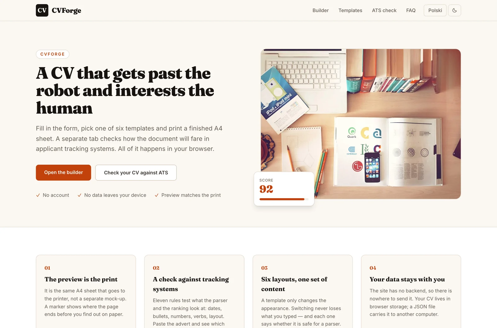
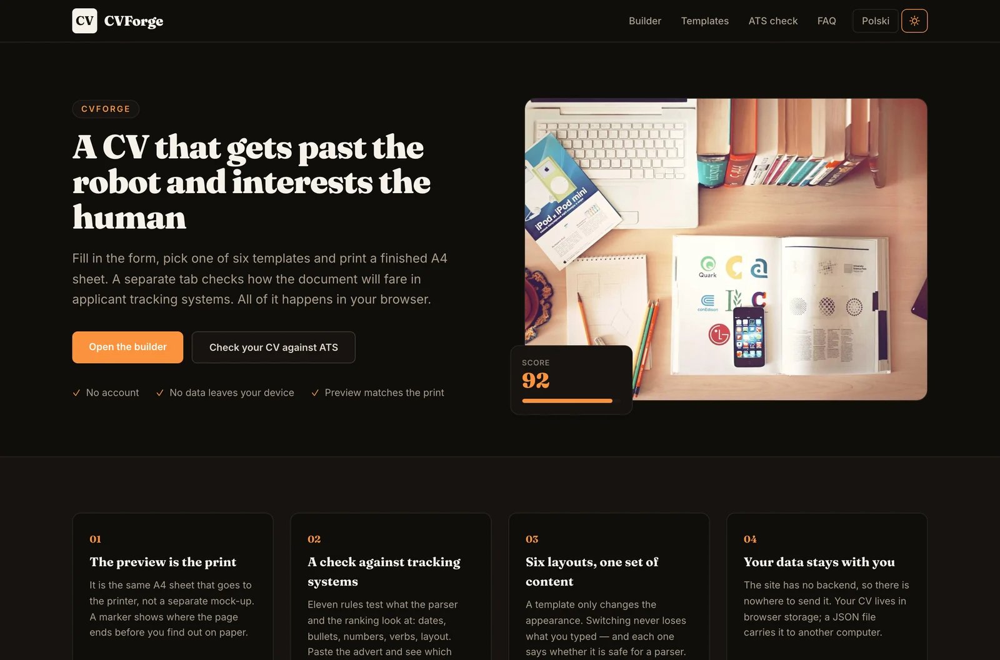
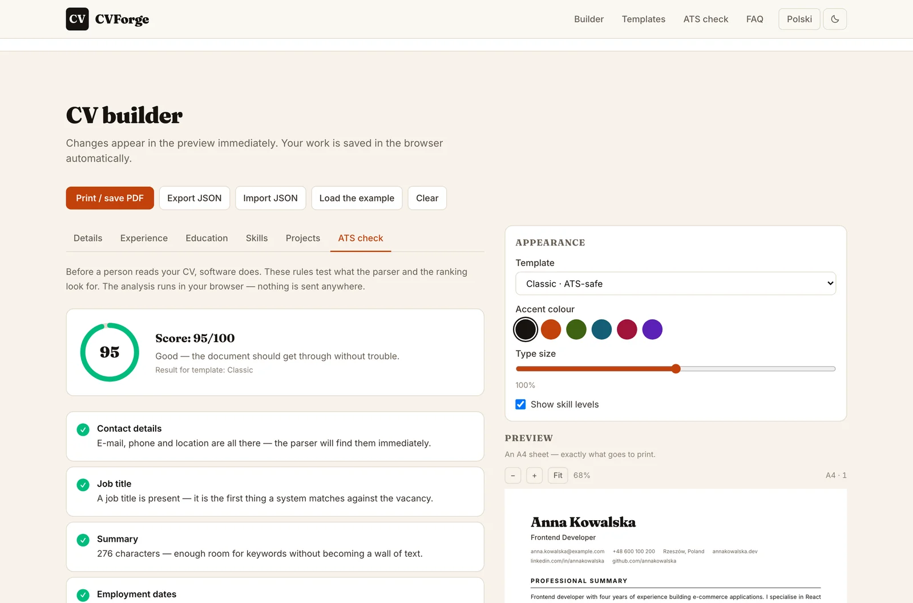
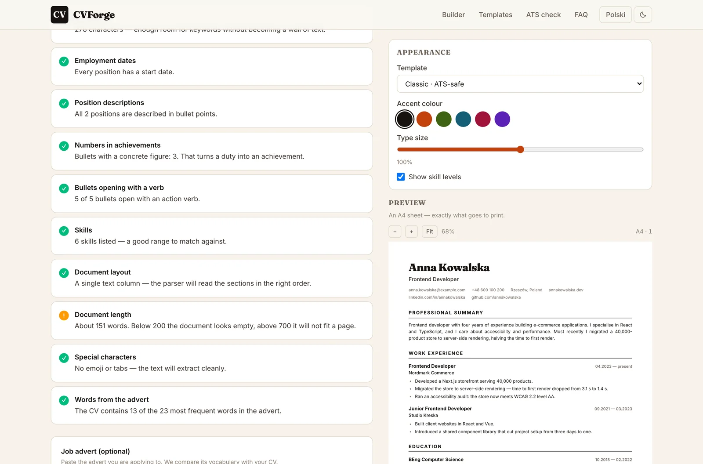
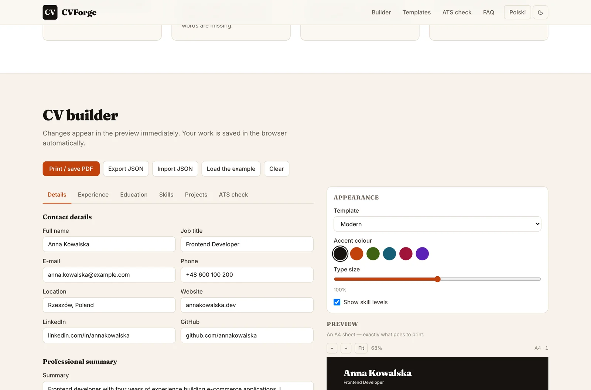
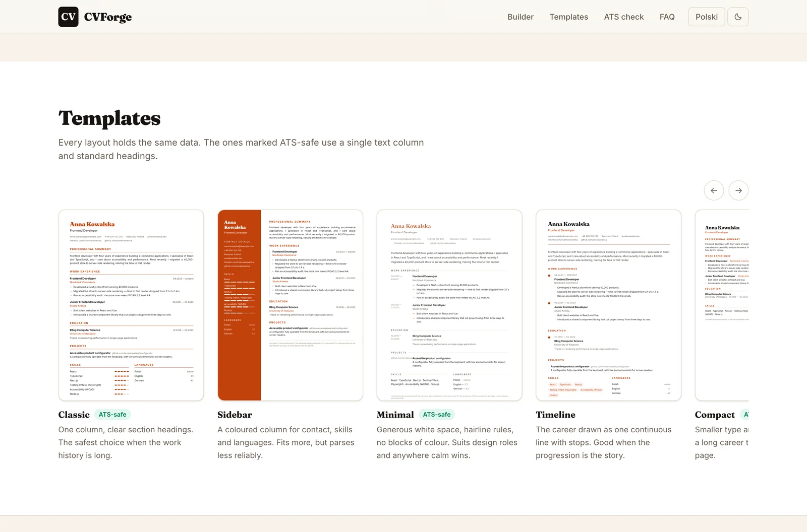

# CVForge

> 📄 **The preview is the print** — a CV builder with an ATS check, rendering the same A4 sheet on screen and on paper

**CVForge** turns a form into a finished CV. Fill in your details, choose one of six templates, and print an A4 sheet that looks exactly like the preview. A separate tab reviews the document the way an applicant tracking system would, and tells you what it found.

There is no backend, no account and no upload. The site is prerendered to files and served by GitHub Pages; your CV lives in your own browser and leaves it only when you export it yourself.

[](https://github.com/dawidolko/CVForge-Platform/actions/workflows/deploy.yml)


**Live:** [cvforge.dawidolko.pl](https://cvforge.dawidolko.pl) · **Polski:** [cvforge.dawidolko.pl/pl](https://cvforge.dawidolko.pl/pl/)

---

## 🎯 Key Features

- **The preview is the printed sheet** — not a separate mock-up. The same element is scaled on screen and sent to the printer, so nothing shifts when you press Print. Zoom, fit-to-width and a marker showing where the page ends.
- **An ATS check that explains itself** — eleven rules test what a parser and a ranking look at: contact block, dates, bullet points, numbers in achievements, action verbs, skill count, layout, length and risky characters. Paste a job advert and it also reports which of its words are missing from your CV.
- **Six templates, one set of content** — Classic, Sidebar, Minimal, Timeline, Compact and Modern read the same data. Changing the layout never drops a field, and each one states whether it is safe for a parser.
- **Light and dark themes** — applied before the first paint, so the page never flashes the wrong one.
- **Your data never leaves the device** — the site is static and has no server to receive it. Work is saved to `localStorage`, and JSON export moves a CV between computers without an account.
- **Type-size control for the last three lines** — a ±10% slider, for when a CV is almost, but not quite, one page.
- **Bilingual** — English at `/`, Polish at `/pl/`, with matching `hreflang` pairs and separate JSON-LD.
- **A form that a screen reader can use** — every field has a real `<label>` bound by `id`, list rows can be reordered from the keyboard, and status messages are announced through `aria-live`.

---

## 🖼️ Screenshots

| The premise in one screen                                          | The same page in dark mode                                            |
| ------------------------------------------------------------------ | ----------------------------------------------------------------------- |
|  |  |

| The ATS check with its rules                                        | Keyword match against a pasted job advert                             |
| --------------------------------------------------------------------- | ----------------------------------------------------------------------- |
|  |  |

| The builder and live A4 preview                                      | The template gallery                                                   |
| ---------------------------------------------------------------------- | ------------------------------------------------------------------------ |
|  |  |

---

## 📐 Why the Preview Matches the Print

Most builders draw a preview and generate the PDF somewhere else, which is why the output rarely matches the screen. CVForge renders **one** element, `.arkusz`, fixed at `210mm × 297mm`:

- **On screen** it is scaled with `transform: scale()` and a `ResizeObserver`, while its own width stays 210mm. Scaling never changes how the text wraps.
- **On paper** `@page { size: A4; margin: 0 }` applies, the interface is hidden with `visibility`, and the transform is reset — the browser prints the sheet at its true size.

Because the sheet carries its own margins, the print dialog should be set to **no margins**. Everything else is already in the design.

---

## 🔎 The ATS Check

Most CVs are read by software before a person sees them. The parser wants plain text in predictable places; the ranking wants the words from the advert. `src/components/atsCheck.ts` tests both, and every rule reports what it looked for, so the score can be argued with rather than trusted blindly.

| Rule | What it checks |
| --- | --- |
| Contact details | E-mail shape, phone and location — the fields an auto-filled application form reads first |
| Job title | Present at all; it is the first thing matched against the vacancy |
| Summary | 200–800 characters: shorter carries no keywords, longer will not be read |
| Employment dates | Every position has a start date, or experience cannot be calculated |
| Descriptions | Positions described in bullet points rather than prose |
| Numbers | Bullets that quantify the result instead of naming a duty |
| Action verbs | Bullets opening with a verb — Polish and English lists, feminine forms included |
| Skills | Between five and eighteen named skills |
| Layout | Whether the chosen template is a single text column |
| Length | Roughly 200–700 words, the span of a usable single page |
| Characters | Emoji and tabs that break text extraction from a PDF |
| Advert keywords | With a job advert pasted in: which of its most frequent words appear in the CV |

The analysis runs entirely in the browser — the advert you paste is never sent anywhere.

---

## 🧩 Application Layer

| Layer                            | Responsibility                                                                                          |
| -------------------------------- | --------------------------------------------------------------------------------------------------------- |
| `src/app`                        | Routing, per-language metadata, fonts, JSON-LD. Two prerendered routes: `/` and `/pl/`.                    |
| `src/components/Builder.tsx`     | The single owner of resume state — tabs, appearance, autosave, print, import and export.                    |
| `src/components/ResumeForm.tsx`  | The form. Stateless: it receives data and an updater, so it cannot disagree with the preview.               |
| `src/components/ResumePreview.tsx` | The A4 sheet, its scaling, zoom and page-break markers. Picks a template; never touches the data.          |
| `src/components/AtsPanel.tsx`    | The ATS tab: score, per-rule findings and the advert keyword match.                                         |
| `src/components/atsCheck.ts`     | The review itself — eleven rules plus keyword extraction, all pure functions.                                |
| `src/components/TemplateGallery.tsx` | The gallery rail. Thumbnails are the live templates, not screenshots.                                    |
| `src/components/templates/`      | The six layouts. Each renders the same model and hides empty sections instead of printing bare headings.    |
| `src/components/resume.ts`       | Types, the demo CV and date formatting.                                                                     |
| `src/components/storage.ts`      | `localStorage` behind a guard, plus JSON import and export with shape validation.                           |
| `src/components/content.ts`      | Every string in both languages. Layout lives in components, words live here.                                |
| `src/components/ThemeToggle.tsx` | The light/dark switch and the script that applies the theme before the first paint.                         |
| `src/app/globals.css`            | Design tokens, the A4 sheet and the print rules. No component hard-codes a hex value except the live accent. |

---

## 🛠️ Technology Stack

### Frontend

| Technology       | Version | Role                                                                     |
| ---------------- | ------- | ------------------------------------------------------------------------ |
| **Next.js**      | 16      | App Router with `output: 'export'` — the whole site is prerendered to files. |
| **React**        | 19      | Component model; state lives in one place and flows downwards.             |
| **TypeScript**   | 5       | Strict mode. The CV model is a type, so a template cannot read a missing field. |
| **Tailwind CSS** | 4       | CSS-first configuration; design tokens declared in `@theme`.              |

### Infrastructure

| Element            | Role                                                                   |
| ------------------ | ---------------------------------------------------------------------- |
| **GitHub Actions** | Typecheck, build and an export assertion before anything is published.  |
| **GitHub Pages**   | Static hosting on a custom domain, published to `gh-pages` and as a Pages artifact. |
| **localStorage**   | The only storage the application has — there is no database.            |

---

## 🚀 Getting Started

### Prerequisites

- Node.js 20 or newer
- npm

### 1. Clone the repository

```bash
git clone https://github.com/dawidolko/CVForge-Platform.git
cd CVForge-Platform
```

### 2. Install dependencies

```bash
npm install
```

### 3. Run

```bash
npm run dev        # development server at http://localhost:3000
npm run build      # static export into out/
npm run serve      # serve the built export locally
npm run typecheck  # TypeScript, no emit
npm run verify     # typecheck + build, the same pair the CI runs
```

---

## 🎨 Design

A print shop, not an app: warm paper (`#faf8f5`), ink black for text and a single saffron accent (`#c2410c`) for anything that acts. Display type is **Fraunces**, a serif with real weight; body text is **Inter**.

Both themes are declared as tokens, so components never hard-code a colour. The A4 sheet is the one deliberate exception — it stays ink on white paper even in dark mode, because that is what the printer produces.

Inside a CV the accent colour is chosen by the user from six options and is the only value a template writes inline.

---

## ♿ Accessibility

- Every input has a real `<label>` bound with `id` — no placeholders standing in for labels.
- The theme is applied before the first paint, so nobody sees a flash of the wrong one.
- Tabs expose `role="tablist"`, `aria-selected` and `aria-controls`; the panel points back with `aria-labelledby`.
- Reordering and removing rows are ordinary buttons with text labels, reachable and operable from the keyboard.
- Saving, importing and clearing announce themselves through `role="status"` with `aria-live="polite"`, without stealing focus.
- Range inputs carry `aria-valuetext`, so a screen reader reads “3” rather than a raw percentage.
- A skip link, a visible focus ring on every interactive element and a `prefers-reduced-motion` block that disables animation.

---

## 📁 Project Structure

```
CVForge-Platform/
├── .github/workflows/deploy.yml   # typecheck, build, export assertion, publish
├── docs/screenshots/              # images used by this README
├── public/                        # favicon and CNAME
└── src/
    ├── app/
    │   ├── globals.css            # tokens, the A4 sheet, print rules
    │   ├── (en)/                  # English at /
    │   └── (pl)/pl/               # Polish at /pl/
    └── components/
        ├── Builder.tsx            # state, tabs, appearance, print, import/export
        ├── ResumeForm.tsx         # the form
        ├── FormFields.tsx         # labelled field primitives
        ├── ResumePreview.tsx      # the A4 sheet, zoom and page breaks
        ├── AtsPanel.tsx           # the ATS tab
        ├── atsCheck.ts            # the eleven rules and keyword extraction
        ├── TemplateGallery.tsx    # live template thumbnails
        ├── ThemeToggle.tsx        # light/dark switch
        ├── templates/             # Classic, Sidebar, Minimal, Timeline, Compact, Modern
        ├── resume.ts              # types, demo data, date formatting
        ├── storage.ts             # localStorage, JSON import/export
        └── content.ts             # all copy, PL and EN
```

---

## 📄 License

MIT © [Dawid Olko](https://dawidolko.pl)
